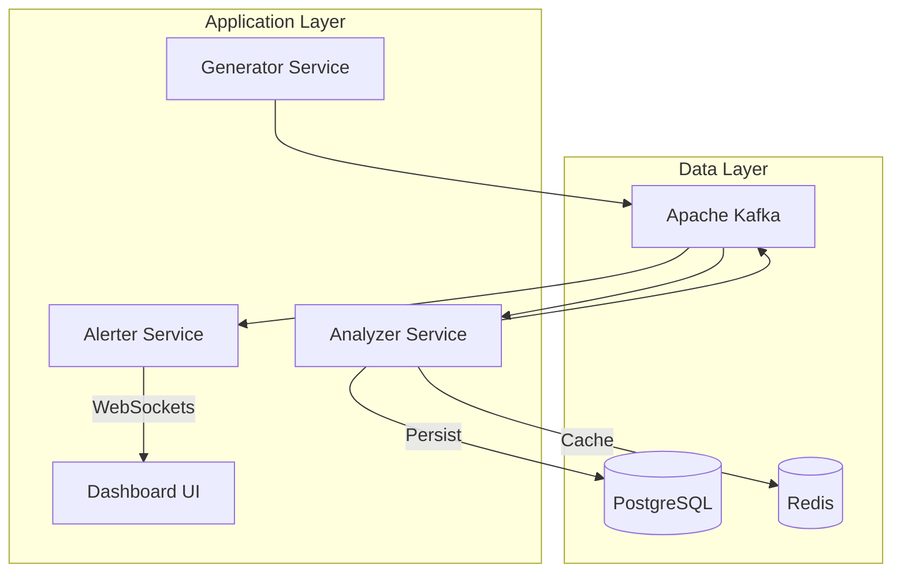

# Sentinel - Distributed Real-Time Fraud Detection Engine

> **Current Status:** 🚧 Under Active Development

A distributed, real-time fraud detection engine built on Event-Driven Architecture using Kafka, Quarkus, and Spring Boot.

## 🏗 Architecture

The system uses a microservices approach to process high-velocity transaction streams.

